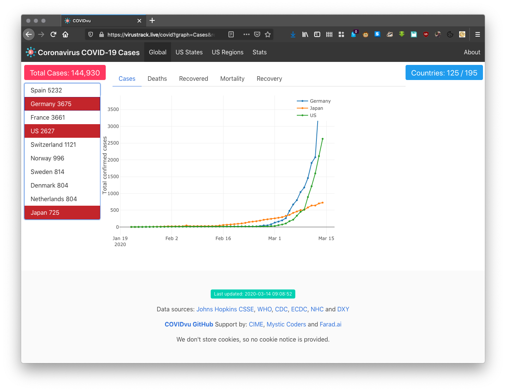

# COVIDvu

Looking for the latest COVID-19 country and state level numbers?  Head to the
[virustrack.live COVID-19 dashboard](https://virustrack.live).



This project hosts the COVID-19 Virus Track live website and provides a
the COVIDvu (COVID-19 viewer) zero-install data science lab for exploring the
pandemic.  The project is divided in these phases:

1. Build and deploy the zero install data science lab - DONE
1. Build and deploy the virustrack.live website to provide near real-time
   pandemic information in the form of comparative trend plots - DONE
1. Ensure data ingress from reliable, consistent, robust data sources - IN 
   PROGRESS - only JH CSSE and BNO News seem to be up-to-date and their data
   sources are in flux
1. Evolve the website and tools from data extraction and trend display toward
   prediction
1. Expand the lab and website to provide tools and information for tracking
   and visualizing other zoonotic spillovers, or to revisit previous spillovers
   like Ebola and SARS.

## License

COVIDvu is released under the terms of the BSD 3-Clause License. See LICENSE.txt for
 more information or see https://opensource.org/licenses/BSD-3-Clause.

## Data Visualization (Curious?)

The goal of this project is to visualize the public COVID-19 data using software
modules to aggregate and display this data (with integrity) to the public. Anyone
can clone this repo and see the data gathered so far using a Jupyter notebook. See
[https://jupyter.org/](https://jupyter.org/)

Seeing this data may require some technical configuration and software installation
on your machine. The foundation of this project is driven with Python. Jupyter notebooks
are already part of this project and they contain Python instructions to render the
data currently being analyzed.

We recommend NOT using the Docker environment if your goal is to just view the data
in the same manner as our developers and not via the website [virustrack.live COVID-19 dashboard]
(https://virustrack.live).

### Prerequisites

Running Jupyter notebook requires Python 3.3+ and the notebooks for this project require
specific Python modules that may or may not be installed on your machine. We recommend
using virtualenv with the Python package installer (pip) to configure any missing
modules for this effort.

```bash
$ cd work
$ python3 --version # python3 installed?
$ python3 -m pip install --user virtualenv
$ python3 -m pip install -r requirements.txt
$ python3 -m pip install jupyter
```

Your Python environment should now be ready

### Using Jupyter Notebook

In the same terminal, run the Jupyter Notebook application and you will be able to then
run the preparatory Python code and then the visualizations that have been created to
date.

```bash
$ jupyter notebook
# A web server should start and NPM will open a browser tab with the Jupyter Notebook environment
``` 

Begin by navigating into the work/ folder and opening the README.ipynb (Interactive Python Notebook). 
This will look very much like a standard README, but the Python blocks (visually noted) can be run
interactively just like you would in the Python interpreter (>>>).

## Developers (Contributing)

This project is designed so that developers and scientists can work in a
zero install environment by pulling a Docker image and performing all research
and coding activities within a container.  Users may also chose to use their 
preferred IDE and other Python tools and work on the file system, without ever
runnint the dockersized version.  This instructions show how to install and run
this zero install container.


### Run from a Docker container, zero install

Prerrequisites:  `docker-compose` must be available in the target system.  These
instrutions are UNIX-specific.

- Clone this repository

  `git clone https://github.com/pr3d4t0r/COVIDvu.git covidvu`

- Go to the `covidvu` directory

  `cd covidvu`

- Set the COVIDvu Jupyter working directory to the current directory by creating
  a runtime configuration via the `run.env` file

  ```
  cp run.env.SAMPLE run.env
  ```

  Change it to reflect your development environment and preferences

  ```
  export COVIDVU_JUPYTER_MOUNT_POINT="/Users/joeuser/development/covidvu"
  export COVIDVU_NIC_BIND="127.0.0.1"
  export COVIDVU_PORT_BIND="8808"

  ```

- Start the container using the `./run` script

  ```
  ./run
  ```

  Wait until Docker pulls the latest image becaues the COVIDvu lab is based on
  the 4.5 GB (JupyterLab Data Science Notebook Docker image](https://hub.docker.com/r/jupyter/datascience-notebook/)

  A confirmation message appears in the console after the image pull completes
  and the lab starts

  ```
  Status: Downloaded newer image for pr3d4t0r/covidvu:latest
  Creating covidvu_cime_dev ... done
  ```

- Get the JupyterLab authentication token to confirm that the container is
  running

  ```
  docker logs covidvu_cime_dev

  # Output:

      To access the notebook, open this file in a browser:
        file:///home/jovyan/.local/share/jupyter/runtime/nbserver-17-open.html
    Or copy and paste one of these URLs:
        http://d57f7b87cf42:8888/?token=025c268f52a758f66112c115e5e407842c71de68be440475
     or http://127.0.0.1:8888/?token=025c268f52a758f66112c115e5e407842c71de68be440475

  ```

- Open the JupyterLab by going to http://localhost:8808/lab, then enter the
  authentication token in the appropriate box; choose a password to avoid this
  step in the future


- Open a terminal to verify that files and other work are managed by Git

  ```
  # Enter these commands in a JupyterLab terminal!
  git branch -a

  # Output: 

  * master
    remotes/origin/0006-Automatic-data-refresh
    remotes/origin/0011-plot-untracked-outcomes
    remotes/origin/0016-Front-end-scaffolding
    remotes/origin/0021-Local-launch-instructions
    remotes/origin/HEAD -> origin/master
    remotes/origin/JA-refactor-interact
    remotes/origin/master
  ```

Git, Python, Vim, and various tools are all available from the command line and
in some of the existing notebooks.  Look at the `Makefile` to see what tools are
installed to complement the JupyterLab setup.

- Install the `plotly` and `cufflinks` packages and make them available to the
  lab and notebooks, to confirm that everything is working as expected

  ```
  # In the ./work directory:
  pip install -r requirements.txt
  ```

After careful consideration, the core team decided that embracing standard
Python tools like `pip` is a better policy than managing packages and workflows
using Anaconda.


---
## Run the COVIDvu notebook

The system uses the Johns Hopkins University CSSE dataset to do its work.
Pull the datasets they made available on GitHub via the README notebook at
http://localhost:8808/notebooks/work/README.ipynb

- Run the cells in the section _Get the latest data from Johns Hopkins CSSE_

Due to limitations in how JupyterLab deals with Plotly and other third-party
tools, the notebooks that display plots must be executed in the JupyterNotebook
environment.  The plots will appear blank if the notebooks are executed inside
the JupyterLab environment.

Ready to generate the visualizations?  Go to http://localhost:8808/notebooks/work/COVIDvu.ipynb
and execute all the cells in order.

That's it!


---
## Live documentation

Look at http://localhost:8808/notebooks/work/README.ipynb for helpful tools.
The section _Improve the command prompt and environment_, for example, sets a
`.bash_profile` with a better prompt, path, aliases, etc. that improve the 
experience when working at the terminal prompt.


---
## Project

Fork this project GitHub at (pr3d4t0r/COVIDvu)[https://github.com/pr3d4t0r/COVIDvu]

- [COVID-19 complete genome](https://www.ncbi.nlm.nih.gov/nuccore/MN908947.3) (8 KB)
- [Johns Hopkins University COVID-19 data sets](https://github.com/CSSEGISandData/COVID-19) - GitHub


---
&#169; 2020 the COVIDvu Contributors team.  All rights reserved.

